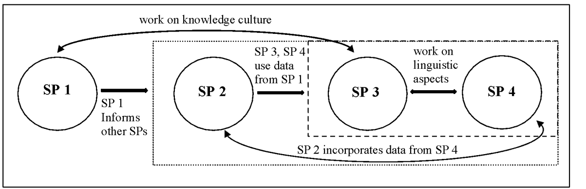

### **ARITHMETIC Project: An Overview**

The **ARITHMETIC** project is a major academic study funded by the European Research Council (ERC), involving research teams from the Universities of Innsbruck and Graz.

* **Core Focus:** The project investigates German arithmetical treatises found in manuscripts from the late Middle Ages, specifically the period of 1400-1522.
* **Central Research Question:** How did the practice of arithmetic develop and spread in the German vernacular (the common language) during the transition from the Middle Ages to the Modern Period?
* **Significance:** While the history of Latin mathematical theory is well-documented, little is known about how practical math skills reached new groups of people, like merchants, through texts written in German. This project fills that gap, exploring the intersection of philology, history, and culture through a digital edition of these important texts.

---

### **Project Structure & Goals**

The project is structured into four interconnected subprojects (SPs), each with a specific focus, that work together to build a comprehensive understanding of late medieval arithmetic.

#### **Subproject 1: Documentation and Context**
* **Goal:** To study the manuscripts as physical objects to understand their production, circulation, and use. This involves analyzing not just the text but the entire context.
* **Methods:**
    * **Codicology:** A detailed description of each manuscript's content, images, history, and a paleographical assessment.
    * **Comparative & Structural Codicology:** Comparing manuscripts to get information on book production and analyzing a codex as a whole to understand its compilation.
    * **Digital Analysis:** Using network analysis and visualization to map the distribution of texts and define manuscript groups.

#### **Subproject 2: Transcription, Encoding, and Annotation**
* **Goal:** To create a semantically enriched digital edition of the manuscripts. This goes beyond a simple transcription to enable deep, interdisciplinary research.
* **Methods:**
    * **"Assertive Edition":** A method that combines traditional textual criticism with digital methods of annotation and knowledge formalization.
    * **Ontology Building:** Conceptualizing an ontology (a formal model of knowledge) for late medieval arithmetic to make connections of knowledge visible within the discourse.

#### **Subproject 3: Philological and Historical Analysis**
* **Goal:** To analyze the content of the texts to draw conclusions about the social and collective knowledge of their users and writers.
* **Methods:**
    * **Discourse Analysis:** Using linguistic and historic-literary methods like lexeme-analysis and analysis of metaphors.
    * **Historical Pragmatism:** Analyzing the text to understand the communicative situations and the influence of oral traditions.
    * **Cultural Connection:** Identifying how other discourses of the time (e.g., religion, trade, other sciences) influenced these arithmetic texts.

#### **Subproject 4: Development of Arithmetical Jargon**
* **Goal:** To study the emergence of a specialized German language for arithmetic, paying close attention to the bilingual (German/Latin) environment of the time.
* **Methods:**
    * **Lexicographical Process:** Compiling a comprehensive glossary of arithmetic terminology.
    .   This involves identifying terms (lemmas), tracing them back to their Latin origins if possible, and analyzing how their meanings may have shifted.
    * **Analysis of Neologisms:** Studying the creation of new German terms that did not have a direct Latin template.

---

### **The Digital Edition: Process and Technology**

The core of the project is the creation of a digital edition, which relies heavily on modern technology for transcription and analysis.

#### **The Research Corpus**
* The project works with a total of 135 manuscripts, with 116 being directly relevant.
* The primary focus is on the **60-70 manuscripts** created before or around the year 1500.
* As of May 2025, transcriptions have been started for most of the corpus, with the pre-1500 manuscripts nearly complete.

*[Screenshot: An image of a manuscript from the corpus, for example, from the Kremsmünster Monastery Library. (from slide 35)]*

#### **Handwritten Text Recognition (HTR) with Transkribus**

The project uses the **Transkribus** software to automate the transcription of these difficult handwritten texts.

* **Model Training:** HTR models are "trained" by providing them with manually transcribed text ("Ground Truth"). The project's process was iterative:
    * **Early Models (Model 2, 4):** Started with a small number of manuscripts. The Character Error Rate (CER) was initially high but improved as more data was added.
    * **The Breakthrough (Model 5):** A significant improvement was achieved by training the model on a larger corpus of manuscripts from the 15th century with similar handwriting styles.
    * **Generic Model:** The team created a powerful generic model for 15th-century texts, trained on **28 manuscripts** and over **286,000 words**.
* **Performance:** The models' accuracy steadily increased. The CER (a measure of errors) on the validation set dropped from **7.60%** with Model 2 to **5.71%** with the "Model 5 plus".

* **HTR Challenges:** Even with advanced models, challenges remain, especially with:
    * Complex fractions.
    * Multi-line calculations and tables.
    * Pages with unusual or non-linear layouts.

*[Screenshot: An image of a challenging manuscript page with a "mindmap" layout, such as ÖNB, Cod. 3502. (from slide 70)]*

#### **The Annotation Process**

Annotation adds layers of meaning to the raw text. This is a two-step process:

1.  **In Transkribus:** Structural elements are tagged, including headers, initials, glosses, and a detailed list of mathematical figure types (e.g., `multiplication_table`, `regula_de_tri`, `interest_calculation`).
2.  **In an XML Editor (Oxygen):** Deeper semantic annotation is performed to tag key entities like **People**, **Places** (trade cities, routes), **Goods**, and **Currencies**. The mathematical content of entire paragraphs is also categorized.

### **The Final Product & Future Work**

#### **Features of the Digital Edition**
The publicly accessible digital edition will provide:
* High-resolution images of each manuscript.
* Both a diplomatic (as-is) and an expanded transcription.
* A downloadable, comprehensive glossary of mathematical and mercantile terms, complete with commentary and links to Latin sources.
* Detailed metadata for each manuscript.

#### **Future Analysis and Research**
With the digital edition taking shape, the project is moving into deeper analysis:
* **Text Mining:** Using tools like **Voyant-Tools** and **AntConc** to perform similarity analysis on the texts, hoping to reveal clusters of transmission and patterns in terminology.
* **Network Analysis:** Visualizing the data to trace **trade routes** and commercial networks by mapping the cities mentioned in the reckoning examples.

