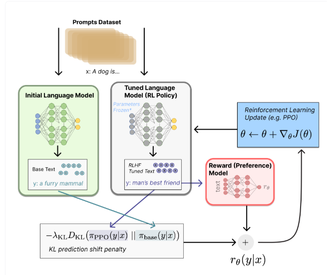
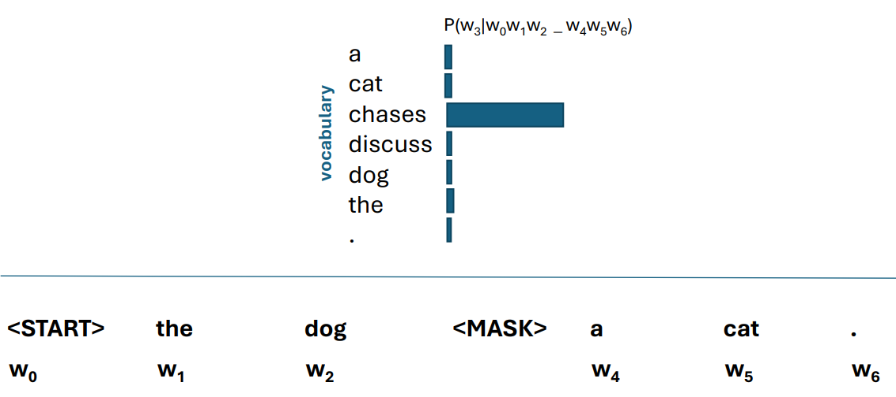

Notes from the presentation "Large language model analysis and applications in Digital Humanities" by Benjamin Roth, Loris Schoenegger, and Vanja Karan from the University of Vienna.

### 1\. Introduction to Large Language Models (LLMs)

#### **What is an LLM?**

  * An LLM is an artificial neural network trained on massive amounts of text to predict subsequent text based on a given context (a prompt).
  * It works by predicting one word at a time, with each new word being added to the context for the next prediction.
  * The process can be initiated with a special `<START>` symbol to generate text from scratch.
  * LLMs are essentially classifiers that calculate the probability of the next word given the preceding words (e.g., $P(w\_{n+1}|w\_{0}...w\_{n})$).

#### **How LLMs Learn**

  * **Training:** LLMs are trained by initializing their parameters randomly and then repeatedly presenting them with text contexts. The model predicts the next word, and its parameters are adjusted to increase the probability of the correct, observed word. This is done for billions of examples.
  * **Pattern Recognition:** Through training, LLMs learn to recognize patterns in language, including groups of similar words and larger linguistic structures.
  * **Instruction Tuning:** Modern models like ChatGPT undergo further training to follow instructions. This involves:
    1.  Initial next-word prediction training.
    2.  Learning from a large set of example instructions and their answers.
    3.  Learning from human feedback to ensure answers are helpful, harmless, and honest, a process known as **Reinforcement Learning from Human** Feedback (RLHF).

#### **Types of Language Models**

  * **Auto-regressive Language Models (ARLM):**
      * These models predict text from left-to-right.
      * They are primarily used for *generating* text.
      * Examples include GPT, GPT-2, and ChatGPT.
  * **Masked Language Models (MLM):**
      * These models predict a "masked" or hidden word based on its surrounding context (words before and after it).
      * They are primarily used for *analyzing and categorizing* existing text by learning contextualized vector representations.
      * Examples include BERT, RoBERTa, and ALBERT.

### 2\. LLM Evaluation

Evaluating LLMs is crucial to understand their capabilities and limitations. Evaluation can be categorized by *what* is being evaluated and *how* it is evaluated.

#### **How to Evaluate**

  * **Automatic Evaluation:**
      * Involves comparing the LLM's output to a human-written "ground truth".
      * This works well for questions with clear, categorical answers.
      * For tasks with more variable answers, metrics like BLEU or BERTScore are used to measure similarity.
      * A key challenge is that an LLM evaluator might favor answers similar to its own style, regardless of quality.
  * **Manual (Human) Evaluation:**
      * Human annotators judge the LLM's output based on various dimensions like fluency, accuracy (veracity), and safety.
      * For creative tasks, humans might rate aspects like grammaticality, cohesiveness, likability, and relevance to the prompt.

#### **What to Evaluate**

  * **Linguistic & Cognitive Capabilities:** Testing performance on linguistic tasks (syntax, semantics) and tasks that might suggest understanding, like Question Answering or the Winograd Schema Challenge.
  * **Psychological Experiments:** Adapting experiments from cognitive psychology to test LLM behavior.
  * **Toxicity and Bias:** Checking for unintended behaviors like perpetuating stereotypes, spreading misinformation, or revealing private information.
  * **Typical User Queries:** Evaluating performance on common tasks requested by users, such as generation, brainstorming, summarization, and rewriting.

#### **Evaluation Benchmarks and Methods**

  * **Chatbot Arena:**
      * A platform where users compare outputs from two anonymous LLMs and vote for the better one.
      * Models are ranked using an Elo rating system.
      * **Advantages:** Uses real human judgments on a wide range of tasks.
      * **Disadvantages:** Results can be influenced by user preferences, potential for manipulation exists, and it's not suitable for direct feedback during model development.
  * **MMLU (Massive Multitask Language Understanding):**
      * A dataset of over 15,000 multiple-choice questions across 57 subjects, from humanities to science.
      * **Advantages:** Covers a wide range of topics and can track the quality of new models.
      * **Disadvantages:** Multiple-choice format doesn't test text generation, it's single-turn (no conversation), and there's a risk of data leakage (questions being in the training data).
  * **Multi-modal Evaluation:**
      * Uses datasets that combine different data types, like text and images, to evaluate models that can process them. The Minecraft Dialogue Corpus is an example where a model must understand a conversation in the context of a visual game state.

### 3\. Explainability for LLMs

Explainability seeks to understand *why* a model makes a certain decision.

  * **Interpretability vs. Explainability:**
      * **Interpretability** is a property of the model itself; the model is transparent and can be understood by humans (e.g., a simple decision tree). LLMs are generally not interpretable.
      * **Explainability** involves calculating and presenting the most important factors that led to a model's decision.
  * **Faithfulness vs. Rationalization:**
      * An explanation is **faithful** if it accurately reflects the model's underlying causal process.
      * A **rationalization** is an explanation that seems plausible but is not faithful to the model's actual reasoning. Self-explanations from LLMs are often rationalizations and should not be trusted to understand the model's internal logic.

#### **Types of Explanations**

  * **Feature-based:** Identifies which input features (e.g., words) had the most impact on the output. Methods include LIME and SHAP.
  * **Example-based:** Identifies which training examples most influenced the model's output.
  * **Mechanistic:** Summarizes the causal dependencies within the model itself.

#### **Evaluating Explanations**

Explanations are evaluated on several dimensions:

  * **Faithfulness:** Does the explanation reflect the model's real reasoning? This can be tested by removing the "important" tokens and seeing if the model's output changes significantly.
  * **Stability:** Is the explanation consistent and deterministic?
  * **Usefulness:** Does the explanation help a human user understand and predict the model's behavior? This is often measured through user studies.

Performance model and task dependent!!

### 4\. LLMs in Digital Humanities

LLMs have a wide range of applications in the field of Digital Humanities:

  * **Text Analysis and Interpretation:** Identifying themes, sentiment, stylistic features, and attributing authorship.
  * **Data Mining:** Analyzing large text corpora to uncover historical patterns in migration, economic trends, and cultural dynamics.
  * **Language Translation and Transcription:** Processing large volumes of text that are impractical to handle manually.
  * **Digital Archiving and Curation:** Digitizing content and creating new, interactive ways for users to engage with museum exhibits and archives.
  * **Data Visualization:** Assisting in the creation of visualizations from textual data.