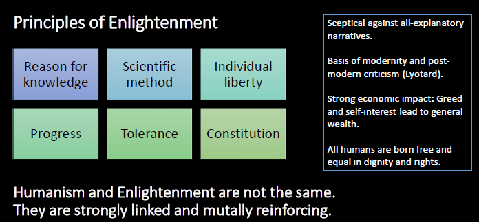
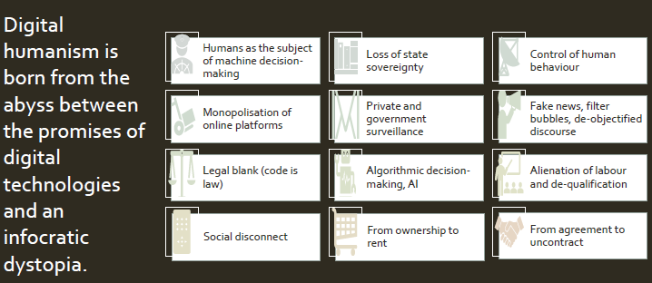
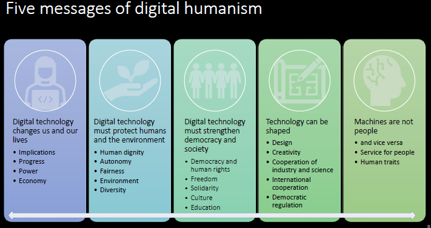
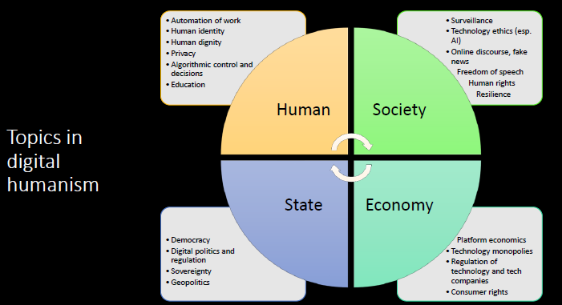
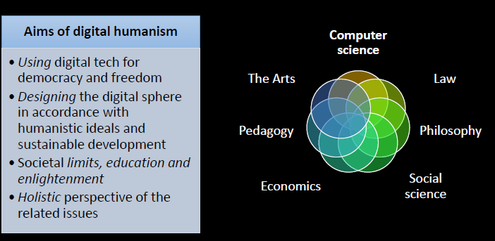

Notes from the presentation "The Good Life Digital and the Power to Shape It" by rich Prem from TU Wien.

### **"The Good Life Digital and the Power to Shape It"**

---

### **Part I: The Good Life Digital**

---

#### **1. Philosophical Foundations**

* **The "Good Life"**: The lecture begins by invoking Aristotle's concept of ethics, where the goal of all actions is happiness realized in a "good life". This is defined as an "activity of the soul according to goodness" over the course of a whole life.
* **Humanism & Enlightenment**:
    * The foundation of humanism is Protagoras's idea that "Man is the measure of all things," meaning the perceiving and thinking human is the standard for all things.
    * It is tied to the Enlightenment, which Immanuel Kant defined as "man's emergence from his self-incurred immaturity". This requires the courage to use one's own reason and take responsibility for one's actions.
    * **Key Principles of Enlightenment**:
        * Reason for knowledge
        * Scientific method
        * Individual liberty
        * Progress
        * Tolerance
        * Constitution
* **Critique of Humanism**: The lecture also acknowledges critiques of traditional humanism, such as its human self-centeredness, idealization of antiquity, and colonialist tendencies.

#### **2. The Rise of Digital Humanism**

* **The Problem**: Digital Humanism emerges from the gap between the promises of technology and an "infocratic dystopia".
* **Issues in the Digital Age**:
    * Humans becoming subjects of machine decision-making.
    * Monopolization of online platforms.
    * Private and government surveillance.
    * Control of human behavior, fake news, and filter bubbles.
    * Alienation of labor and de-qualification.
    * A shift from ownership to renting.
* **Definition**: Digital Humanism is the effort to strive for human dignity and coexistence in the digital age, shaping technology to support human rights, the common good, and sustainability. It is an engineering and design endeavor to create feasible and worthy visions of a digital future.
* **Aims of Digital Humanism**:
    * Using digital technology for democracy and freedom.
    * Designing the digital sphere in accordance with humanistic ideals and sustainable development.
    * Establishing societal limits, education, and enlightenment.
    * Taking a holistic perspective on all related issues.
  

#### **3. The Vienna Manifesto & Core Principles**

The Vienna Manifesto on Digital Humanism outlines key principles for shaping our digital future:

* **Democracy & Inclusion**: Technologies should be designed to promote democracy and inclusion.
* **Rights & Freedoms**: Privacy and freedom of speech are essential values. Platforms like social media must be altered to better protect these rights.
* **Regulation**:
    * Effective laws must be established based on public discourse to ensure fairness, accountability, and transparency in algorithms.
    * Regulators must intervene to restore market competitiveness against tech monopolies.
* **Human-in-Control**:
    * Decisions with the potential to affect human rights must be made by accountable humans, not left to markets or machines.
    * Automated systems should only support, not replace, human decision-making.
* **Education & Collaboration**:
    * Interdisciplinary approaches are required, breaking down silos between computer science, social sciences, and humanities.
    * Universities have a special responsibility to produce new knowledge and cultivate critical thought.
    * Education on computer science and its societal impact must start early.

---

### **Part II: The Power to Shape It**

---

#### **1. How Technology Shapes Us**

* **Design is Not Neutral**:
    * Simple design decisions in interfaces have a lasting impact on what is considered important. The interface can empower or disempower users.
    * Users are often given the illusion of choice, which is limited by formal constraints (e.g., limited gender options) or "dark patterns" designed to trick them.
* **Disowning Through Software**:
    * There is an "illusion of ownership" when physical products are controlled by software.
    * **The John Deere Case**: The company tried to prevent farmers from modifying the software on tractors they owned (costing over $100,000). In response, farmers began hacking their own equipment using "pirate software" to access diagnostic programs. The case has led to class-action lawsuits.
* **Unilateral Changes**:
    * Companies change terms of use, requiring users to agree to new data collection to continue using a product they already own. Examples include TV manufacturers transmitting viewing habits or vacuum cleaners submitting apartment layouts.
    * This raises questions about the meaning of "agreement" when consent is coerced.
* **Geopolitics**: Digital systems are critical infrastructure for national economies and are now tools of power and targets in conflicts.

#### **2. How to Reclaim Power**

* **Set Limits Democratically**:
    * We must lead a democratic discourse to establish rules and limits for technologies that significantly impact our lives.
    * Society, not companies or the market, should make the law.
    * The state must have the authority to enforce these rules everywhere.
* **Recognize Algorithmic Limits**:
    * Algorithms struggle with context and intent. For example, it is difficult for a machine to distinguish between art, medicine, and pornography based on formal criteria like nudity alone.
    * AI can generate harmful or illegal texts, such as instructions for making drugs or encouraging suicide.
* **Be Careful What You Wish For**:
    * A key philosophical question is raised: Should we aim for a society that makes unruly behavior *impossible* (e.g., through perfectly ethical AI), or should we preserve the human "right to violate the rules?".
* **Core Principle: "Machines are not people."**
    * Digital technology should be beneficial for people, not the other way around.
    * The differences between humans and machines should not be blurred.

#### **3. Related Concepts**

* **Transhumanism**: The idea of improving the human body with technologies like bio-implants or brain-computer interfaces to overcome deficits like illness and death.
* **Posthumanism**: The idea that an artificial intelligence will eventually overcome and surpass humans, making the human body useless.

### **Conclusion**

The central message of the lecture is that **technology is not a destiny**. It can and must be shaped through democratic processes to align with humanistic values and create a "good life digital."