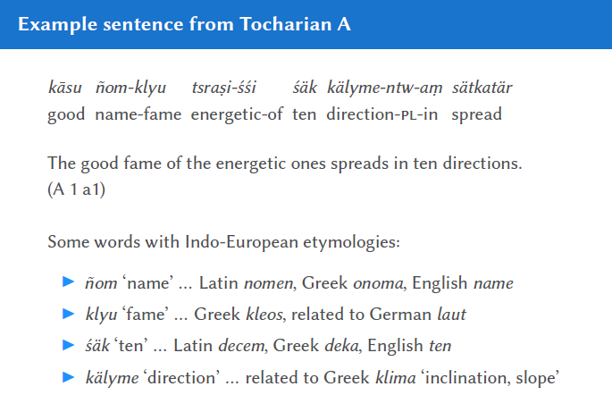
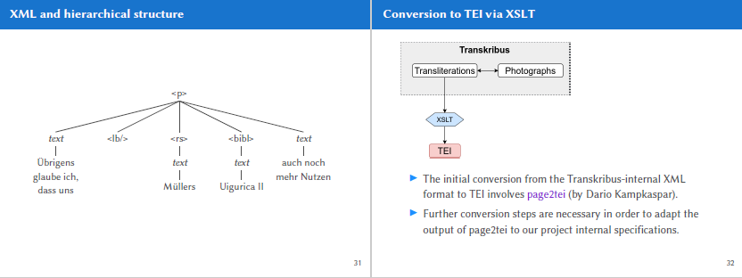
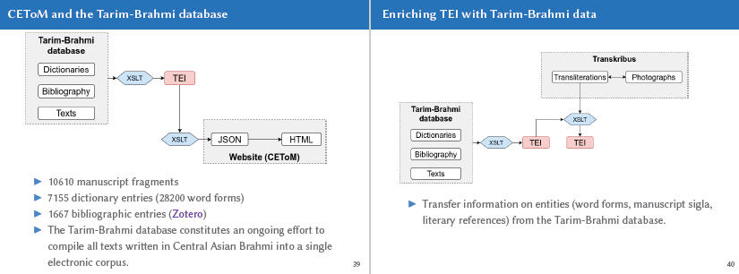
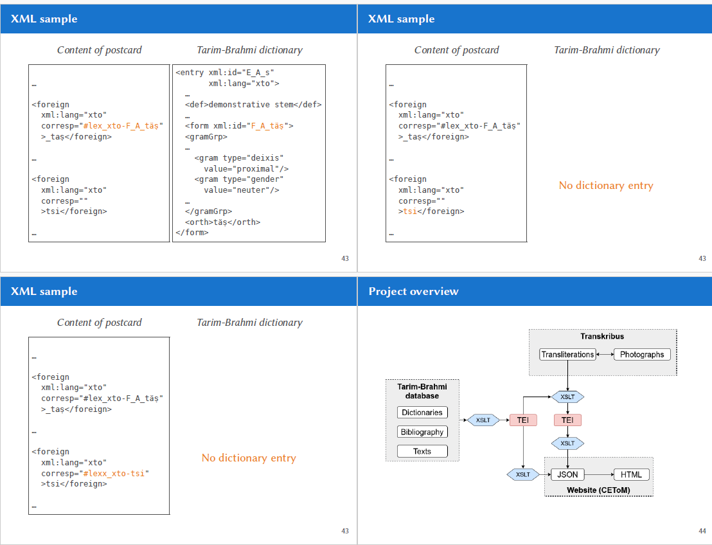

Notes from the presentation "A digital edition of
modern research on
ancient texts: Wilhelm
Siegling’s nachlass" by Bernhard Koller from University of Vienna.

### **A Digital Edition of Wilhelm Siegling's Nachlass**

---

#### **1. Background: The Tocharian Languages & Wilhelm Siegling**

* **The Languages**:
    * Tocharian manuscripts, discovered in the Tarim Basin (modern Xinjiang, China) around the turn of the 20th century, represent a previously unknown branch of the Indo-European language family.
    * There are two related languages: **Tocharian A** (East Tocharian) and **Tocharian B** (West Tocharian).
* **The Text Corpus**:
    * The texts are mostly Buddhist literature, with a small number of secular documents like monastic records and caravan passes.
    * The manuscripts are severely damaged and fragmentary; perfectly preserved leaves are very rare.
* **Wilhelm Siegling (1880-1946)**:
    * A co-founder of Tocharian studies, alongside his collaborator Emil Sieg.
    * He published the first grammatical overview (1908), a major edition of Tocharian A texts (1921), a grammar of Tocharian A (1931), and posthumous editions of Tocharian B texts.

---

#### **2. Wilhelm Siegling's Nachlass**

---

##### Wilhelm Siegling (1880–1946)

* **Born**: 1880 in Erfurt
* **Died**: 1946 in Berlin
* **Field**: Co-founder of **Tocharian studies** (with Emil Sieg)

##### Education and Early Career

* **1901–1906**: Studied **Avestan**, **Sanskrit**, and **Tibetan** in Berlin
* **1906**: Began collaborating with **Emil Sieg** to decipher Tocharian manuscripts at the *Museum für Völkerkunde*, Berlin

##### Major Contributions

* **1908**: Published the **first grammatical overview** of Tocharian

  * Introduced the distinction between **Tocharian A** and **Tocharian B**
  * *(Sieg and Siegling 1908)*

* **1915–1918**: Served in **World War I**

* **1921**: Published an edition of **466 Tocharian A fragments** from the Berlin Turfan collection

  * *(Sieg and Siegling 1921)*

* **1931**: Published a **grammar of Tocharian A**

  * *(Sieg, Siegling, and Schulze 1931)*

* **1949, 1953**: Posthumous publications of **633 Tocharian B fragments** from the Berlin Turfan collection

  * *(Sieg and Siegling 1949, 1953)*

---

* **What it is**: Siegling's academic estate (*Nachlass*), stored at the Georg-August-Universität Göttingen, consists of his research materials. This project was provided with high-resolution scans of the documents.
* **Contents**: The collection includes:
    * Letters (many from Emil Sieg)
    * Postcards (most from Emil Sieg)
    * Letter drafts
    * Siegling's personal notes
* **Why it's Interesting**:
    * **Window into Research**: Sieg and Siegling lived in different cities for most of their 39-year collaboration, so their letters and postcards document the "making of" some of the most important foundational texts in their field.
    * **Attribution of Ideas**: The correspondence reveals how hypotheses were developed and attributed between the two scholars.
    * **Historical Context**: It provides a unique glimpse into the lives and relationship of two academics through two world wars, including the challenges of academic publishing during WWII.
    * **Personal Relationship**: The letters show a close personal relationship, with informal exchanges about money and "feasts".
    * **Annotations**: Siegling often made personal annotations and corrections directly on the letters and postcards he received from Sieg, offering further insight into his thought process.

---

#### **3. The Digital Edition Project: Goals & Workflow**

**Aim**:
To create a **digital, queryable edition** of Wilhelm Siegling’s *Nachlass* and integrate it into a broader research ecosystem.

##### **Main Goals**

* Transcribe **all written documents** within Siegling’s *Nachlass*
* Create a **TEI-encoded** version of the transcriptions enriched with:

  * References to **scholars**, **literature**, and **linguistic forms**
  * **English summaries** of each document
* **Publish** the data on **CEToM** (Central Asian Texts on the Move) in a **searchable/queryable** format

##### **Status**

* All **photographs** of the documents are publicly available
* Only a **subset has been transcribed** so far

---

##### **Step 1: Transcription in Transkribus**

* Photographs of the documents are uploaded to **Transkribus**.
* The software performs automatic layout analysis and text recognition (OCR/HTR).
* This automatic output is then **manually corrected**, and entities of interest (like people, places, literary references, and Siegling's own annotations) are marked up with tags.

##### **Step 2: Conversion to TEI**

* The transcribed and tagged data from Transkribus is converted into a structured **TEI (Text Encoding Initiative) XML** format.
* This is a multi-step process using **XSLT stylesheets** managed by a Python script.
    * An initial conversion is done with a tool called `page2tei`.
    * A custom "TEI Chain" of further XSLT transformations cleans the data, restructures it, expands abbreviations, and adds necessary metadata to create valid, project-specific TEI files.
* **Challenge**: Some letters were folded and used like booklets, meaning the reading order jumps between pages. This is solved either by manually rearranging text after conversion or by using custom tags in Transkribus to automate the reordering during conversion.

##### **Step 3: Integration with the CETOM Ecosystem**

* The project integrates the *Nachlass* data into a pre-existing digital environment for Tocharian studies.
* **CETOM (A Comprehensive Edition of Tocharian Manuscripts)**: An ongoing effort to compile all texts written in Central Asian Brahmi script into a single electronic corpus. It started as an FWF-START project to make edited Tocharian manuscripts publicly available.
* **Tarim-Brahmi Database**: A follow-up project that took CETOM as its starting point. It now includes:
    * 10,610 manuscript fragments
    * A dictionary with 7,155 entries
    * A bibliography with 1,667 entries
* **Enrichment**: The TEI files of the *Nachlass* are enriched by linking them to the Tarim-Brahmi database. For example, when a Tocharian word is mentioned in a letter, a reference is added in the XML that links it directly to its entry in the digital dictionary.

---

#### **4. Publication and Final Output**

* **Website**: The final digital edition is published on the CETOM website.
* **Features**:
    * Users can view the original photographs of the documents alongside the transcriptions.
    * The text is searchable.
    * An **index** allows users to find all mentions of specific entities like people (e.g., Emil Sieg), places (e.g., Berlin), manuscript fragments, and specific Tocharian word forms across all the transcribed documents.
* The overall workflow is: **Transkribus** → **TEI** → **Enriched TEI** → **JSON** → **HTML** (for the website).