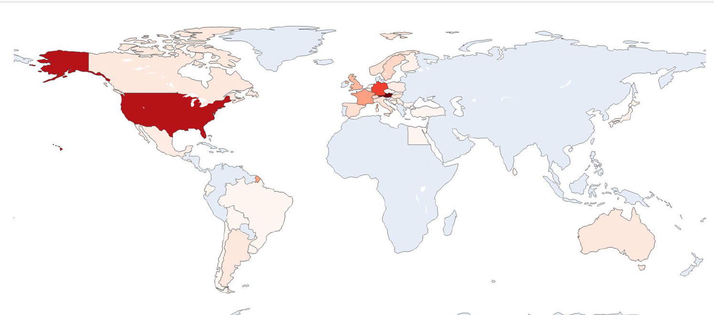
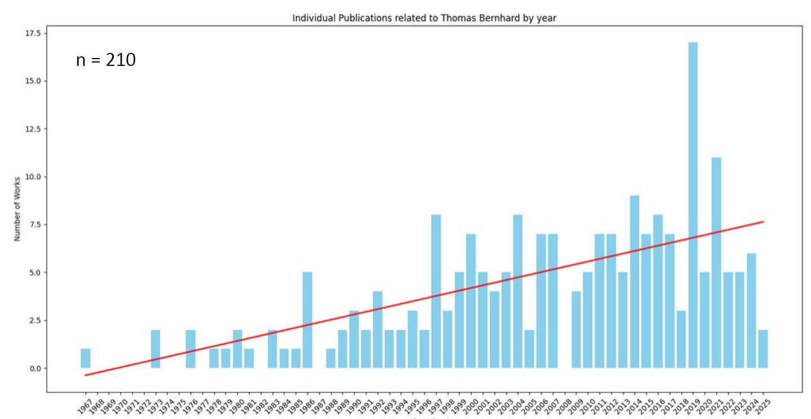
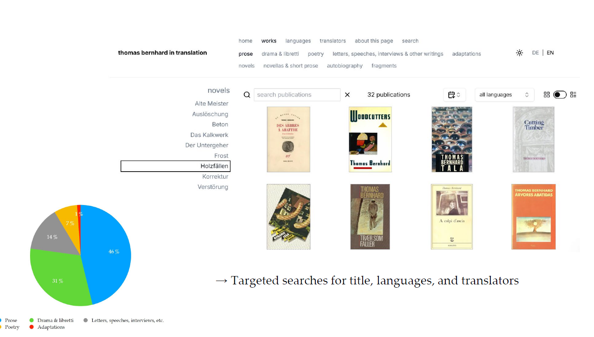
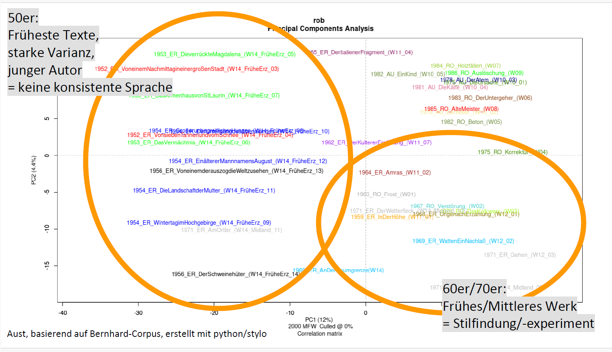
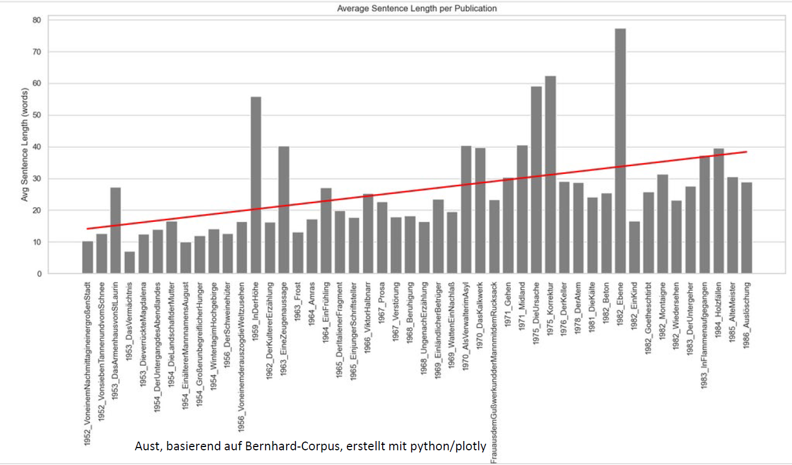
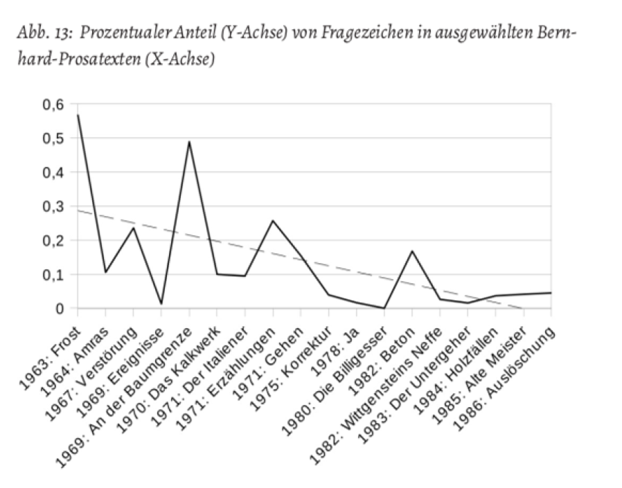
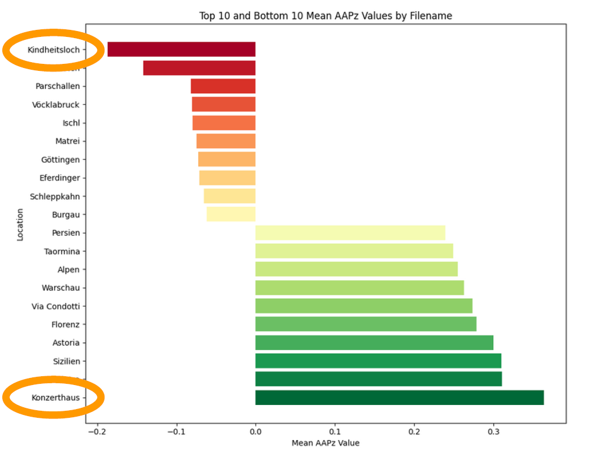
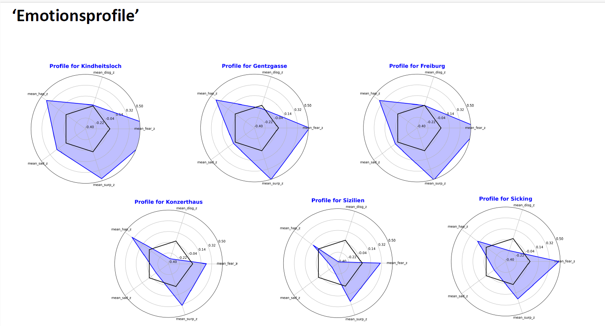

### **Digital Approaches to Thomas Bernhard**

---

### **Part 1: Introduction - Bernhard's View on a Technicized World**

This section establishes the thematic foundation of the presentation by connecting Thomas Bernhard's literary concerns with the methods of digital analysis used to study his work.

* **The World as a Machine:** Bernhard's writing is deeply preoccupied with the cold, rational, and "technicized" nature of the modern world. He saw humanity itself becoming mechanized.
    * **Direct Quote from *Verstörung* (1967):** "Calculating machines, that's all people are... The world is more and more just a computer."
    * **Obsessive "Studies":** This theme is prominent in novels like *Das Kalkwerk* and *Korrektur*, where protagonists are trapped in absurdly detailed, pseudo-scientific projects, reflecting a world where "Life is just science."

* **A Style of Deconstruction:** Bernhard's literary style mirrors his worldview. He advocated for dismantling holistic structures.
    * **Quote on Destruction:** "There must be nothing whole, one must smash it."
    * **Writing as a Destructive Game:** He described his own process as building up complex sentence structures like a child's toy, only to "smash everything together again."

* **The "Bernhard Machine":** His style became so iconic that it has been described by others as a predictable, repetitive "machine" or a "trick" (*Masche*). This recognizable, almost algorithmic style makes his work particularly suitable for computational analysis.

---

### **Part 2: Metadata & Databases - Mapping Bernhard's Universe**

This section covers large-scale projects that collect and visualize data *about* Bernhard's work, its translations, and its influence.

#### **Project 1: *Global Bernhard***

* **Purpose:** To track and document the international reception and influence of Thomas Bernhard on other writers. The project highlights how authors globally have engaged with, reacted to, or struggled against his powerful style, which has been called a "curse" and a "virus."
* **Methodology:** A database built on the TYPO3 platform collects examples of authors influenced by Bernhard, including bibliographic data and quotes.
* **Key Findings (from Data Visualizations):**
    * **Geographic Reach:** The strongest influence is seen in Austria and Germany, followed by the USA and France.
    * **Publication Trends:** There was a major spike in publications related to Bernhard around 1999, the 10th anniversary of his death. Publications about his reception and translations are increasing.
    * **Demographics:** The project allows for detailed analysis of author demographics, such as gender distribution across different generations.

#### **Project 2: *thomas bernhard in translation***

* **Purpose:** The first comprehensive online database of all published translations of Bernhard's works.
* **Scope & Features:**
    * Contains over 1,000 entries for publications in 42 languages.
    * Users can perform targeted searches for specific titles, languages, or translators.
    * It provides rich metadata, including translators, publishers, and publication years.
    * **A unique feature** is the analysis of book covers, which reveals how marketing and reception are visually guided in different countries.
* **Key Findings:**
    * **Most Translated Works:** *Wittgensteins Neffe* and the autobiographical works (*Die Ursache*, etc.) are among the most frequently translated.
    * **Translation Peaks:** The highest number of first translations occurred in the 1980s and 1990s.

#### **Future Project: *Forschungsstelle Thomas Bernhard***

* This is a planned digital research hub that will integrate multiple databases (translations, theatre productions, reviews, etc.) into a single, interconnected platform using a flexible data model.

---

### **Part 3: Text Data & Text Mining - Deconstructing Bernhard's Style**

This section applies computational methods directly to the text of Bernhard's prose to analyze his style with quantitative precision.

#### **1. Stylometry: Mapping the Evolution of Bernhard's Style**

* **Methodology:** Stylometry measures stylistic similarity between texts by analyzing the frequency of the most common words (like "the," "and," "but"). It doesn't interpret meaning but reveals underlying authorial patterns. **Principal Components Analysis (PCA)** is used to visualize these similarities as clusters.
* **Key Findings:**
    * **Confirmation of Work Phases:** The analysis provides quantitative evidence for the traditionally defined phases of Bernhard's career.
    * **Early Work (1950s):** The texts are stylistically scattered, showing an author experimenting and finding his voice.
    * **Middle Work (1960s-70s):** The texts form a clearer cluster, demonstrating a period of stylistic consolidation.
    * **Late Work (1980s):** The late novels (*Holzfällen*, *Alte Meister*, *Auslöschung*) are clustered extremely tightly, proving that he had developed a highly stable and recognizable late style.
    * **Autobiography:** His five autobiographical books form their own distinct stylistic group, separate from his other fiction.

#### **2. Linguistic Repetition and Sentence Structure**

* **Sentence Length:**
    * There is a clear trend of increasing average sentence length over his career.
    * The analysis pinpoints extreme examples, such as the single sentence in *Korrektur* that is **1,156 words long**. Visualizing sentence lengths in his novels like *Korrektur* shows a pattern of "swelling and receding" waves, which has been compared to musical structures like Ravel's *Bolero*.

* **Lexical Diversity (Type-Token Ratio - TTR):**
    * The TTR, which measures vocabulary richness, shows a consistent **decrease** over his career. This quantitatively proves that his language became more repetitive and lexically sparse over time.
* **"Bernhardisms":** The analysis tracks the frequency of his signature words and phrases (e.g., *naturgemäß*, *sogenannt*, *dachte ich*, *wie ich sagen muss*). The usage of these "tics" varies and helps define his different work phases.

#### **3. Sentiment Analysis: Mapping Emotions in Places**

* **Methodology:** This innovative approach combines two techniques:
    1.  **Named Entity Recognition (NER):** Automatically identifies all place names (e.g., "Vienna," "Rome") in the texts.
    2.  **Sentiment Analysis:** Uses a lexicon (SentiArt) to calculate the average emotional "valence" (positive/negative polarity, anger, fear, happiness, etc.) of the sentences in which each place name appears.
* **Key Findings:**
    * **Beyond "City-Insults":** While Bernhard is famous for his rants against Austrian cities, the analysis reveals a more complex emotional landscape.
    * **The Positive South:** Locations in Southern Europe (Sicily, Florence, Rome) are consistently associated with a more positive emotional context, fitting their role as places of escape in his later works.
    * **Psychological vs. Real Places:** The most intensely emotional locations are not actual cities but **"psychological spaces."**
        * Most Negative: ***Kindheitsloch*** ("childhood hole"), a term for the traumatic space of his youth.
        * Most Positive: ***Konzerthaus*** ("concert hall"), representing the transcendent power of art.
    * **Emotion Profiles:** This method can generate unique "emotion profiles" for different locations, visualizing the specific mix of sadness, happiness, fear, etc., associated with each one.

