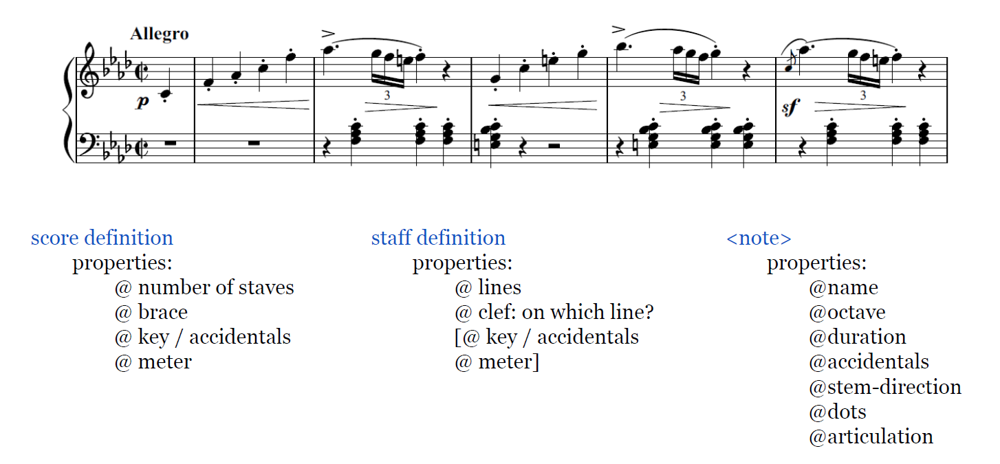
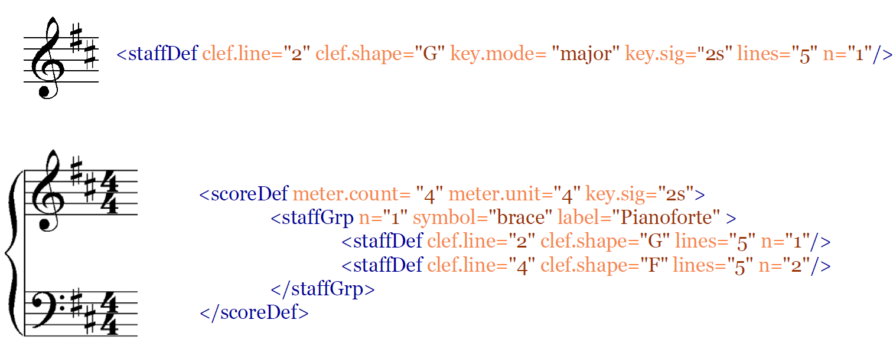
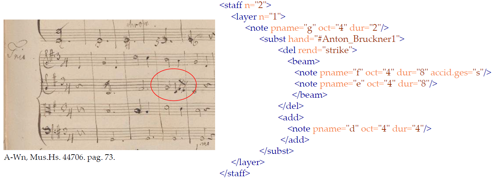
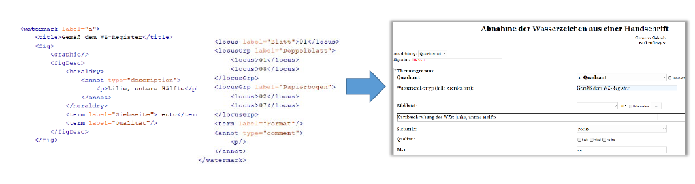
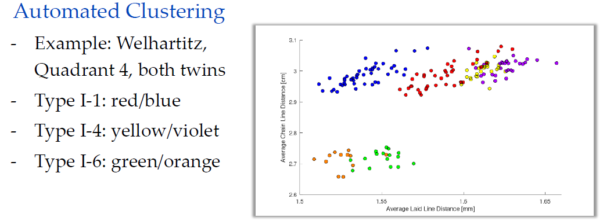

### **Schubert-digital**

---

#### **1. Introduction to Digital Musicology**

Digital Musicology is a sub-field of Digital Humanities that applies computational methods to musical sources and data.

* **The Core Challenge of Music:** Music is fundamentally a "time-ordered set of sounds" (for the listener) or "gestures" (for the performer). Creating a static, readable representation (like a score) is a complex translation that involves many assumptions and conventions.
* **The "Big Tent" of Digital Musicology:** Like Digital Humanities, it's a broad field encompassing many activities:
    * **Music Corpus Studies:** Creating and analyzing large digital collections, like catalogues of a composer's complete works.
    * **Digital Music Philology:** The creation of scholarly digital editions of musical texts.
    * **Music Performance Analysis:** Studying recordings and performance data.
    * **Computational Music Theory:** Using algorithms to analyze musical structures.

---

#### **2. Music Encoding: Turning Scores into Data**

Music encoding is the process of representing musical notation in a structured, machine-readable format. This is essential for any computational analysis.

* **Complexity:** It's more complex than encoding plain text because a score contains multiple layers of information:
    * **Score Properties:** Key signatures, time signatures, number of staves.
    * **Note Properties:** Pitch (e.g., C, F#), octave, duration (e.g., quarter note), articulations (staccato, accent), stem direction, beams, and slurs.

* **History of Encoding Formats:**
    * The first format was **DARMS** (1960s).
    * Other formats include Humdrum, MuseData, and the widely used **MusicXML**.
* **The Music Encoding Initiative (MEI):**
    * MEI is the current gold standard for scholarly work. It is an **XML-based system** modeled on the Text Encoding Initiative (TEI).
    * Its goal is to create a highly detailed, machine-readable structure for encoding music documents, flexible enough for everything from simple songs to complex orchestral scores.
    * MEI captures not just the notes, but also information about the physical source, editorial changes, and different versions.
    * A tool like **Verovio** is needed to render the MEI code visually as a standard musical score.

MEI captures not just the notes, but also information about the physical source, editorial changes, and different versions.
Application scenarios of the MEI header:
Scholarly editions of music: Indication of different sources and scribes’ hands are needed for the critical apparatus.
Work catalogue: Giving information about the work without using the music section of the file.
Performance database: Specification of the performance data is also possible in the header.

---

#### **3. Scholarly Digital Editions**

The goal of a scholarly edition is to publish a musical text based on a critical and thorough examination of the historical sources (e.g., manuscripts, early prints). MEI is the ideal tool for this.

* **The 9 Steps of Editorial Work:**
    1.  Source research
    2.  Deciphering (reading the handwriting)
    3.  Source description
    4.  Source evaluation (determining which is most reliable)
    5.  Comparing readings (different versions)
    6.  Determining source dependency (e.g., this copy was made from that original)
    7.  "Higher" criticism (making editorial judgments)
    8.  Producing the musical text
    9.  Producing the critical report (explaining all decisions)
* **Encoding Editorial Changes:** MEI allows editors to digitally tag specific actions found in the manuscript, such as deletions (`<del>`), additions (`<add>`), or substitutions (`<subst>`), and attribute them to a specific person (e.g., the composer or a later editor).

---

#### **4. The *Schubert-digital* Project**

*Schubert-digital* is an online research platform applying these digital methods to the autograph (handwritten) manuscripts of Franz Schubert.

* **Scope:** The project aims to document the roughly **500 surviving Schubert autographs** (totaling ~4,700 pages), most of which are held in Viennese collections.
* **Primary Aims:**
    1.  **Detailed Source Description:** To create a comprehensive digital record of every manuscript's physical characteristics.
    2.  **Digital Reunification:** To digitally reassemble manuscripts that were broken apart and scattered across different libraries after Schubert's death.
* **The Data Model:** The project uses a sophisticated data model to distinguish between:
    * **`Gesamtmanuskript`:** The complete, reconstructed manuscript as it was originally created by Schubert.
    * **`Bestandteil`:** The physical fragment or section of the manuscript as it exists today in a library.
* **Reconstructing Paper Structure:** MEI is used to encode the physical structure of the manuscript gatherings (quires). It records how individual sheets of paper (`bifolium`) were folded and nested together. This allows for a virtual reconstruction of the original manuscript booklet.

---

#### **5. Watermark Digitization & Thermography**

Watermarks are designs embedded in paper that are crucial for dating a manuscript and tracing its paper to a specific mill.

* **How Watermarks Are Made:** In manual papermaking, a wire design (the watermark) is sewn onto the wire mesh of a mould. This mould is dipped in paper pulp, and the paper ends up slightly thinner where the wire design was.
* **The Challenge:** Watermarks can be very faint and are often obscured by the ink of the musical notation written on top of them.
* **Solution: Thermography**
    1.  A manuscript page is placed on a gently heated copper plate.
    2.  A high-resolution **infrared camera** takes a picture of the page.
    3.  Heat travels faster through the thinner parts of the paper (the watermark).
    4.  The resulting image, a **thermogram**, clearly reveals the watermark design, free from the visual interference of the ink.

---

#### **6. Advanced Analysis: Digital Reconstruction & Automated Clustering**

The thermographic images of watermarks and paper structure enable powerful new research methods.

* **Digital Reconstruction:** By identifying matching watermarks on scattered pages, researchers can digitally "stitch" them back together to reconstruct the original, full paper sheet from which they were cut.

[Image Placeholder: Diagram showing two separate manuscript pages being digitally combined to form one original sheet, Slide 102]

* **Automated Clustering (The Paper's "Fingerprint"):** The project uses algorithms to analyze the physical structure of the paper itself, which is unique to the mould that made it. This allows for grouping papers even without a clear watermark.
    * **Method 1: Radon Transformation:** Detects and measures the precise distance between the vertical **"chain lines"** in the paper's mesh.
    * **Method 2: Laid Line Density:** Measures the density of the very fine horizontal **"laid lines."**
* **The Result:** By plotting these two measurements on a graph, papers made on the same physical mould form tight, distinct **clusters**. This technique is so precise it can distinguish between "twin" moulds—nearly identical moulds that were used in pairs to speed up paper production. This provides an objective, data-driven way to group manuscripts, helping to refine their dating and better understand Schubert's working process.

