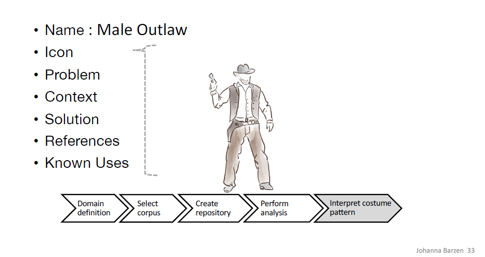

## Quantum Computing Fundamentals & Applications in the Humanities

This summary synthesizes two presentations: "Quantum Computing" by Prof. Frank Leymann and "From Quantum Computing to Quantum Humanities" by Dr. Johanna Barzen, delivered at the University of Vienna in May 2025. It covers the fundamental principles of quantum computing and demonstrates a practical application in the digital humanities.

---

### **Part 1: Fundamentals of Quantum Computing**

#### **The Strange New World of Quantum Physics**

The quantum world operates on principles that are fundamentally different from our everyday classical world. While the classical world is deterministic, the quantum realm is inherently **stochastic**, or probabilistic. You can only know the probability of a measurement's outcome, not the certain result beforehand. This leads to counter-intuitive phenomena.

* **Superposition:** A quantum system can exist in a combination of multiple states simultaneously. The most famous illustration of this is the **Schrödinger's Cat** thought experiment, where a cat in a box is considered both alive and dead until the moment it is observed.

* **The Qubit:** The classical bit is the basic unit of information, existing as either a 0 or a 1. The quantum equivalent, the **qubit**, can be a 0, a 1, or a superposition of both at the same time. Mathematically, this is represented on the **Bloch Sphere**, a unit sphere where any point on the surface represents a possible state for the qubit. This gives a single qubit access to an infinite number of potential states before it is measured.

#### **The Power of Quantum Computing**

* **Quantum Parallelism:** The true power emerges when qubits are combined. A quantum register with 'n' qubits can exist in a superposition of all 2ⁿ possible classical states at once. Applying a single operation to this register manipulates all 2ⁿ values simultaneously. A system of just 300 qubits could process more values in an instant than there are atoms in the known universe.

* **Entanglement:** Described by Einstein as "spooky action at a distance," entanglement is a unique quantum connection between two or more qubits. Once entangled, the state of one qubit instantly influences the other, regardless of the physical distance separating them. This non-local connection is a critical resource; any quantum algorithm showing an exponential speedup over its classical counterpart must leverage entanglement.

#### **How Quantum Algorithms Work**

Most quantum algorithms today are **hybrid**, using both a classical computer (CPU) and a Quantum Processing Unit (QPU).

1.  **Classical Pre-Processing:** A CPU prepares the initial data.
2.  **State Preparation:** The data is loaded into the QPU, encoding it as a quantum state.
3.  **Quantum Computation:** A sequence of operations, represented as a **quantum circuit**, is executed on the qubits.
4.  **Measurement:** The qubits are measured, which collapses their superposition into a definite classical state (0s and 1s).
5.  **Classical Post-Processing:** Because measurement is probabilistic, the computation is repeated thousands of times ("shots"). The CPU analyzes the resulting probability distribution to determine the final, most likely answer.

#### **Applications and The Cryptographic Threat**

Quantum computers promise exponential speedups for specific, complex problems.

* **Key Applications:**
    * **Factoring (Shor's Algorithm):** Can break today's standard encryption (like RSA) by efficiently finding the prime factors of large numbers.
    * **Unstructured Search (Grover's Algorithm):** Provides a quadratic speedup for searching databases, weakening symmetric encryption.
    * **Simulation:** Can accurately simulate molecules for drug discovery and material science.
    * **Machine Learning & Optimization:** Can solve complex optimization problems and enhance machine learning algorithms like Support Vector Machines (SVMs).

* **The Threat and The Solution:** The power of Shor's algorithm poses an imminent threat to global cybersecurity. In response, researchers have developed **Post-Quantum Cryptography (PQC)**—new cryptographic standards (like Kyber and Dilithium) designed to be secure against attacks from both classical and quantum computers.

---

### **Part 2: From Quantum Computing to Quantum Humanities**
*(Based on the presentation by Dr. Johanna Barzen)*

#### **Use Case: Analyzing Clothing in Film with MUSE**

This section demonstrates how quantum computing can be applied to a humanities problem: analyzing "vestimentary communication," or the stories told by clothing in film. The **MUSE** project was created to develop a formal language for understanding costumes.

The core concept is that recurring character types or narrative situations are often represented by recurring **costume patterns**. The MUSE project built a massive repository to identify these patterns.

* **The MUSE Process:**
    1.  **Define a Corpus:** Select genres with strong costume conventions (e.g., Westerns, High School Comedies).
    2.  **Create a Repository:** Meticulously catalog every costume from the selected films using a highly detailed **taxonomy** (with 910 nodes) and **ontology** (with over 3,000 nodes) that break down garments into their base elements, materials, colors, shapes, etc.
    3.  **Identify Patterns:** Analyze the data to find proven solutions to recurring design problems. For example, the **"Male Outlaw"** pattern in Westerns is consistently communicated with a combination of 'long pants', 'shirt', 'revolver', 'cowboy boots', 'Akubra' hat, and 'gilet'.

#### **Introducing Quantum Humanities with QHAna**

The massive, complex dataset produced by MUSE is an ideal candidate for quantum analysis. The **QHAna (Quantum Humanities Analysis Tool)** was developed to bridge the gap between humanities research and quantum computing. It allows non-experts to apply and compare classical and quantum machine learning algorithms.

* **The Challenge of Categorical Data:** Humanities data is often categorical ('red', 'denim', 'worn') not numerical. QHAna solves this by using the **Wu-Palmer Similarity** method. This algorithm calculates a numerical distance between two items in the MUSE taxonomy based on their positions in the hierarchical tree, transforming the qualitative data into a quantitative distance matrix that algorithms can process.

* **Comparing Classical and Quantum Results:** QHAna was used to perform clustering and classification on the MUSE costume data. The results showed that quantum algorithms could outperform their classical counterparts. For instance, the **quantum SVM** (using Quantum Kernel Estimation) achieved a significantly higher classification accuracy (90.9%) than the classical SVM (72.7%).

#### **Goals and Outlook**

QHAna is an open-source, plugin-based tool designed to be independent of any single use case. Its goal is to significantly ease the process of applying advanced computational methods to humanities research. By providing easy access to both classical and quantum tools, it empowers researchers to explore complex cultural datasets in entirely new ways, marking a concrete step from Digital Humanities toward **Quantum Humanities**.

